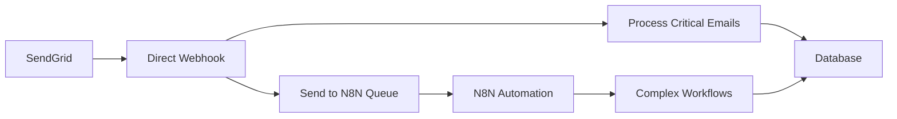

# N8N vs Direct Webhook: Complete Comparison

## Quick Decision Matrix

| Your Situation | Best Choice | Why |
|---------------|-------------|-----|
| **Just starting out** | Direct Webhook | Simpler, faster to implement |
| **< 1000 emails/day** | Direct Webhook | More efficient, lower latency |
| **Complex automation needed** | N8N | Visual workflows, easy modifications |
| **Multiple integrations** | N8N | Built-in connectors |
| **High volume (>10k/day)** | Direct Webhook | Better performance, lower cost |
| **Non-technical team** | N8N | No coding required |
| **Need reliability** | Both (N8N as backup) | Redundancy |

---

## Setup Comparison

### Direct Webhook (SendGrid) - 5 minutes
```javascript
// 1. Add webhook endpoint (already done)
app.post('/api/webhooks/sendgrid', handleEmail)

// 2. Configure SendGrid
// SendGrid Dashboard → Inbound Parse → Add URL

// 3. Add DNS MX record
// reply.domain.com → mx.sendgrid.net

// Done! Emails flow directly to your app
```

### N8N Webhook - 15 minutes
```javascript
// 1. Install N8N
docker run -d --name n8n -p 5678:5678 n8nio/n8n

// 2. Import workflow
// N8N UI → Import → Upload JSON

// 3. Configure credentials
// Add Supabase credentials in N8N

// 4. Point SendGrid to N8N
// SendGrid → URL: http://your-n8n.com/webhook/email-capture

// 5. N8N processes and sends to Supabase
```

---

## Performance Comparison

### Direct Webhook
```
Email Received → SendGrid → Your App → Database
Total latency: ~100-200ms
```

### N8N Webhook
```
Email Received → SendGrid → N8N → Process → Your App → Database
Total latency: ~300-500ms
```

---

## Cost Analysis

### Direct Webhook
- **SendGrid Free**: 100 emails/day
- **SendGrid Essentials**: $19.95/mo for 50k emails
- **Your server**: Already paying for it
- **Total**: $0-20/month

### N8N Webhook
- **SendGrid**: Same as above
- **N8N Cloud Starter**: $20/mo (20k executions)
- **N8N Cloud Pro**: $50/mo (100k executions)
- **Total**: $20-70/month

*Or self-host N8N for free (requires server resources)*

---

## Code Complexity

### Direct Webhook - Simple & Clean
```typescript
export async function POST(request: NextRequest) {
  const email = await request.formData()
  
  // Store in database
  await supabase.from('inbox_messages').insert({
    from: email.get('from'),
    to: email.get('to'),
    subject: email.get('subject'),
    body: email.get('text')
  })
  
  return NextResponse.json({ success: true })
}
```

### N8N - Visual but More Complex
- 10+ nodes in workflow
- Credential management
- Workflow versioning
- Error handling nodes
- Separate monitoring

---

## Reliability & Monitoring

### Direct Webhook
```typescript
// Built into your app
- Application logs
- Error tracking (Sentry)
- Custom alerts
- Database backups
```

### N8N
```javascript
// Separate monitoring needed
- N8N execution logs
- Workflow error handling
- N8N metrics dashboard
- Webhook retry logic built-in
```

---

## When to Use Each

### ✅ Use Direct Webhook When:
1. **Performance matters** - Every millisecond counts
2. **High volume** - Processing thousands of emails
3. **Simple flow** - Email → Database
4. **Cost sensitive** - Avoiding extra services
5. **Full control needed** - Custom business logic
6. **Existing monitoring** - Already have logging/alerts

### ✅ Use N8N When:
1. **Complex workflows** - Multiple steps/conditions
2. **Team collaboration** - Non-developers need to modify
3. **Multiple integrations** - Slack, Discord, CRM, etc.
4. **Visual debugging** - See data at each step
5. **Quick prototyping** - Test ideas without code
6. **Workflow versioning** - Track changes over time

---

## Hybrid Approach (Best of Both)



### Implementation:
```typescript
// Direct webhook handles critical path
export async function POST(request: NextRequest) {
  const email = await parseEmail(request)
  
  // Fast path: Store immediately
  await storeInDatabase(email)
  
  // Async: Queue for automation
  await queueForN8N(email)
  
  return NextResponse.json({ success: true })
}
```

---

## My Recommendation

### Start with Direct Webhook because:
1. **It's already built** - Code is ready in your repo
2. **Faster to production** - 5 minute setup
3. **Better performance** - Direct path to database
4. **Lower complexity** - Fewer moving parts
5. **Cost effective** - No additional services

### Add N8N Later for:
1. **Email autoresponders**
2. **Lead scoring workflows**
3. **CRM integrations**
4. **Complex routing rules**
5. **Team notifications**

---

## Quick Start Commands

### Direct Webhook (Recommended)
```bash
# 1. Run setup script
./scripts/sendgrid-quick-setup.sh

# 2. Test webhook
curl -X GET https://your-app.com/api/webhooks/sendgrid

# 3. Monitor emails
node scripts/monitor-real-response.js
```

### N8N Setup
```bash
# 1. Install N8N
docker run -d --name n8n \
  -p 5678:5678 \
  -v n8n_data:/home/node/.n8n \
  n8nio/n8n

# 2. Access N8N
open http://localhost:5678

# 3. Import workflow
# Use: docs/n8n-email-webhook.json

# 4. Configure credentials
# Add your Supabase credentials
```

---

## Conclusion

**For LeadsUp's email capture**: **Use Direct Webhook**
- ✅ Already implemented
- ✅ 5 minute setup
- ✅ Better performance
- ✅ Lower cost
- ✅ Simpler architecture

**Add N8N later** for advanced automation workflows when you need them.

The direct webhook is production-ready and will handle your email capture perfectly. You can always add N8N on top later without changing the core functionality.